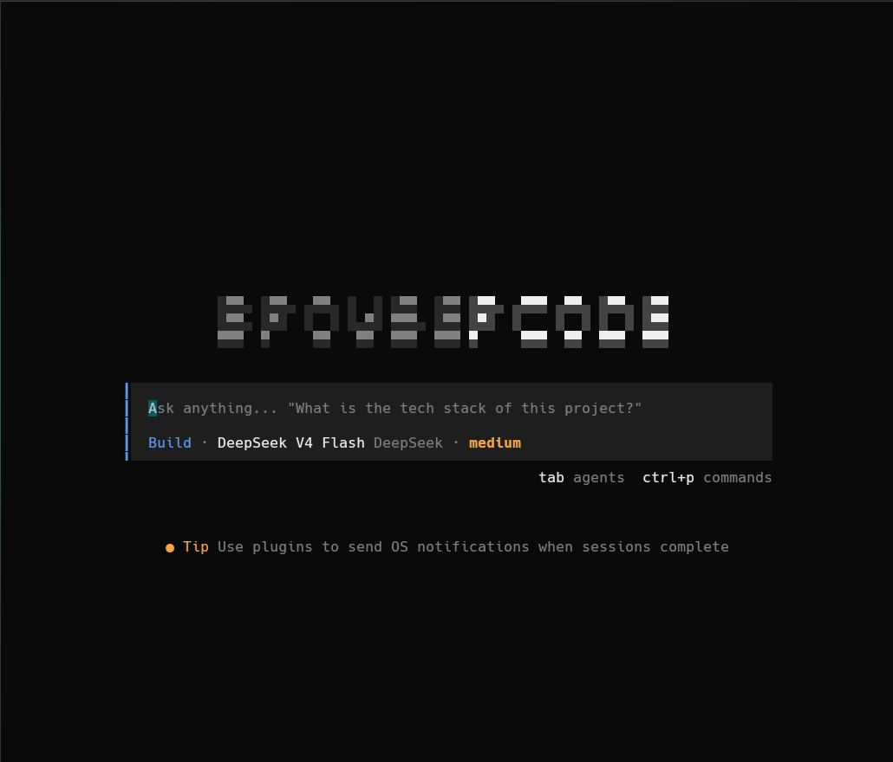

<div align="center">



# Browser Code

**Local-first web capture · multi-source research · knowledge management agent**

[](https://www.npmjs.com/package/browser-code)
[](https://github.com/uuuuytgg/browser-code/releases)
[](LICENSE)
[](#requirements)

[中文](README.md) · [Landing Page](https://uuuuytgg.github.io/browser-code/) · [MCP Setup Guide](wiki/SETUP.md)


</div>

---

## What is this?

Browser Code is a **local knowledge agent** built on a customized [OpenCode](https://github.com/sst/opencode) fork. It automates the full loop of "see a web page/video → understand it → store it in a personal knowledge base → retrieve it any time":

```
You: research the latest progress on speculative decoding

Browser Code:
  ├─ ProReader subagent generates a research plan
  ├─ 12 providers search in parallel (web / GitHub / Wikipedia / Bilibili / YouTube / RED / Douyin…)
  ├─ Cross-validation + confidence labeling
  ├─ Structured report
  └─ On your approval → saved to the local KB (Markdown + SQLite FTS5 index)
```

**Everything stays local.** Your knowledge base is a folder of Markdown files (Obsidian-compatible); SQLite is just a rebuildable search cache.

## Quick Start

```bash
npm install -g browser-code
cd your-project-folder
browser-code
```

On first run, `vault/` (raw content) and `kb/` (knowledge graph) are created in the current directory. Each folder gets its own independent knowledge space.

## Features

| Capability | Description |
|-----------|-------------|
| 🌐 **Web Capture** | Any page → clean Markdown + local assets, with CDP rescue for dynamic pages |
| 🔍 **Multi-source Research** | ProReader subagent orchestrates 12 providers: Plan → Execute → Synthesize |
| 📚 **LLM Wiki KB** | Automatic claim extraction (8 types + confidence), topic/entity linking, FTS5 search |
| 🎬 **Video Summarization** | Transcript extraction + AI summary for YouTube / Bilibili / Douyin |
| 📊 **PPT Generation** | Generate presentation decks from research results |
| 🎓 **Academic Analysis** | Built-in anthropologist, geographer, historian, psychologist subagents |

## Architecture

```
┌─────────────────────────────────────────────────┐
│                  Main Agent                      │
│      Task routing: Direct / Research channel     │
└──────┬──────────────────┬───────────────────────┘
       │                  │
┌──────▼──────┐    ┌──────▼──────────────────────┐
│  ProReader  │    │      Executor subagents      │
│  research   │    │  general (full-tool labor)   │
│  12 providers│   │  + 4 academic experts        │
└──────┬──────┘    └─────────────────────────────┘
       │
┌──────▼──────────────────────────────────────────┐
│           KB pipeline (harness/)                 │
│  enqueue → process-queue → FTS5 index           │
│  vault/ (Markdown source) + kb/ (claims/topics)  │
└─────────────────────────────────────────────────┘
```

**Dual-track subagent system**: expert-type (six-element domain template) + executor-type (I/O standardization). See [AGENTS.md](AGENTS.md).

## 12 Research Providers

`llm_wiki_lite` (local KB first) · `websearch` · `webfetch` · `github` · `wikipedia` · `official_docs` · `youtube_data_api` · `bilibili_mcp` · `douyin_mcp` · `xiaohongshu_mcp` · `tiktok_mcp` · `site_search`

Some providers need extra setup (Python runtime / cookies). See the [MCP Setup Guide](wiki/SETUP.md) (Chinese).

## Privacy

`kb/` and `vault/` contain your locally generated knowledge base data:

- ❌ Never committed to the Git repository (only skeleton files are tracked)
- ❌ Never included in the npm package
- ✅ Stored only on your machine — back up as you see fit

## Requirements

- Node.js >= 18
- Windows x64 / macOS (Apple Silicon & Intel) / Linux x64
- Optional: Bun (local KB server), Python 3.11 (Bilibili/RED providers), Chrome (CDP rescue)

## Development

```bash
git clone https://github.com/uuuuytgg/browser-code
cd browser-code
pnpm install
bun run opencode/packages/opencode/script/build.ts --single
```

Release flow: push tag `v*` → GitHub Actions builds binaries for 4 platforms and uploads to Release → postinstall downloads the right one on install.

## License

MIT
