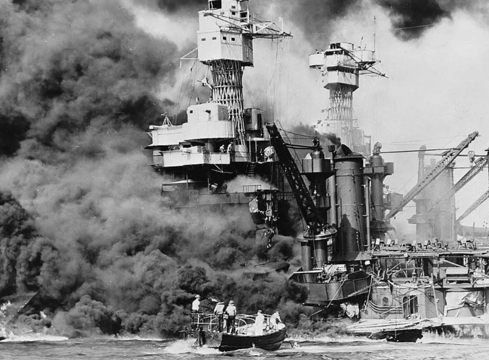
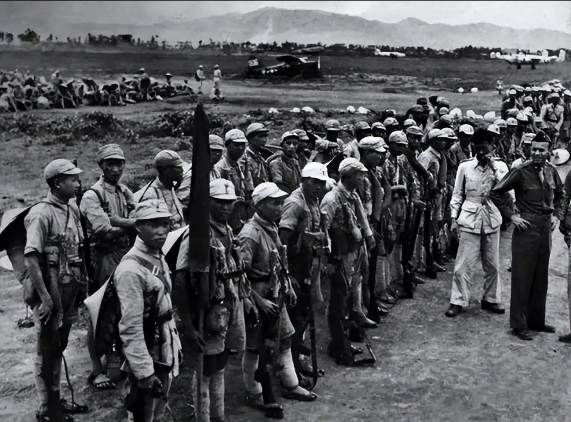
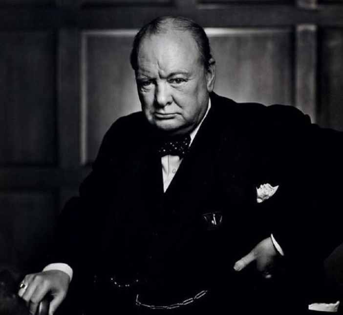
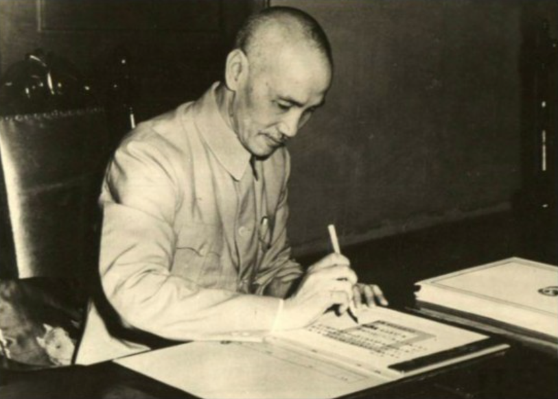

# 1945年香港日军投降，丘吉尔突然横插一脚，蒋介石罕见硬气了一回

**作者：正观历史** · **2026年06月08日**

> 蒋介石一生为祸中华，罄竹难书，但在废除不平等条约，收复香港主权的问题上，也算是为后人做了一件好事。

---

1941年12月7日，在中国人民抗日战争汪洋大海中垂死挣扎的日本法西斯，为了掠夺石油、橡胶这些重要的战争资源，偷袭了美国太平洋海军舰队基地珍珠港，太平洋战争由此拉开了序幕。

随后，英美两国在中国沿海地区和东南亚地区的殖民体系土崩瓦解，美国为了成为全球新的霸主，拉拢中、苏、英等20多个国家组建新的国际联盟，旨在反击由德意日组成的法西斯联盟。

由于日军突然选择了"南进"计划，美英苏在短时间内无暇东顾，因此，美国罗斯福以"各国放弃在华治外法权及有关特权，另立平等新约"为条件，要求蒋介石政府不遗余力牵制日军主力。

尽管当时的蒋介石政府处境十分艰难，但这是国父孙中山遗愿，也是亿万人民的共同诉求。因此，蒋介石随即委派自己的大舅哥、时任中国外交部长的宋子文全权与列强就"废除旧约，另订新约"事宜进行磋商。

此时的英国，名义上仍旧是"日不落帝国"，压根就不想放弃所有在华治外法权及有关特权，便以"亚洲东部地区正处于战争状态，不适合讨论这些"为由，拒绝与蒋介石政府磋商，并表态，等恢复和平了，两国再着手处理此事。

蒋介石对此感到非常恼火，却无可奈何。其名义上是中国领袖，但政令出了重庆就打折扣，在经济、军事上全靠美援，面对英国丘吉尔政府这种耍无赖，也不敢翻脸，只能将希望寄托在美国罗斯福政府的调解。

当时罗斯福为了稳住英苏，不愿意就此事替蒋介石出头，中英之间就解除不平等条约问题暂时搁置。但事情很快就迎来了转机，1942年初，日军进攻缅甸，驻缅英军告急，丘吉尔政府这下不得不厚着脸皮来求中国了。

缅甸当时是英国的心头肉，其稻米占当时全球稻米出口贸易总额的40%；石油年产量超过100万吨；造船、高档家具所需的柚木产量占全球产量约75%；钨矿储量位居全球第二；盛产锡、铜、铅这些重要矿物。

日本若全面占领缅甸，就意味着英国失去了心头肉，且日本得到了缅甸石油将如虎添翼，后患无穷。为了让中国人民咬牙上阵，丘吉尔政府在废除不平等条约的问题上松了口。

由美苏出面做中间人，蒋介石于1942年2月27日正式下令中国远征军赴缅作战；作为中国军队唯一的机械化部队，远征军入缅后随即取得了同古保卫战、仁安羌解围战的胜利，让国际社会看到了中国的实力。

但驻缅英军那副死道友不死贫道的嘴脸表现得淋漓尽致。4月下旬，贪生怕死的英军在未事先告知远征军的情况下突然逃往印度，导致远征军侧翼暴露；更致命的是，英军拒绝提供运输帮助，拒绝空中支援，远征军补给困难，远征救援行动瞬间演变成悲壮的大逃亡行动。

日军占领缅甸掠夺当地战争资源已不可逆转，丘吉尔政府认为中国已没有利用价值后，在废除不平等条约问题上继续打马虎眼，一直到10月10日，正式磋商会谈才开始启动。

10月30日，丘吉尔政府就像挤牙膏一样，向中方代表提交了一份草案：

> **同意废除英在华领事裁判权；废除1901年《辛丑条约》，同意将上海、厦门、天津、广州租界主权归还中国；中方保护英国当前在华不动产产权。**

丘吉尔政府在这份草案中留下了很多隐患，其中，未提及归还香港问题，未提及英国在华沿海贸易权问题，未提及英在华内河航道航行权问题。

假如蒋介石同意了这份草案，英国人只是在军事上结束了对华殖民统治，在经济、技术各方面仍旧拥有法外特权。对此，蒋介石深知谁的拳头大谁说了算的道理，对付英国这种流氓，得来点硬的。

因此，蒋介石再三叮嘱宋子文，除了草案提及的内容，还要废除英国人在华的一切特权，香港行政管理权连同香港官有资产和债务都必须归还中国，否则没得谈。

1943年初，正逢英国在反击法西斯战争中从防御转向反攻的关键时刻，为了争取国际社会的支持，丘吉尔以香港实际控制权还在日本手中为由，香港问题留待战后磋商，其他问题均按蒋介石提出的意见处理。

1月11日正式"废除旧约，另订新约"那天，宋子文奉蒋介石之命，发表声明：中国保留日后对香港提出讨论之权。

这一天，尽管中国没能收复香港，但这是中国人民近一个世纪以来不断流血牺牲而取得的胜利，也为日后继续收复香港奠定了法理基础。

---

1945年8月15日日本投降后，按照同盟国统帅部决议，中国大陆（东北地区除外）及沿海岛礁、中南半岛北纬16°以北地区的日军均向中国战区统帅蒋介石投降。

这个时候，丘吉尔政府变卦了，一边派出舰队，一边告知蒋介石政府，香港日军要向英国军队投降。

蒋介石则命令代理外交部长吴国桢向英国政府交涉：**在未得到中国战区统帅授权的情况下，在中国战区的任何地方登陆的外国军队，后果自负。**与此同时，火速命令粤军做好作战准备。

遗憾的是，蒋介石政府对美国依赖太大，自己腰杆不够硬，所有的决策都会打折扣。英国新首相艾德礼私下与美国新总统杜鲁门达成某种交易，美国迅速出卖了中国的利益，让英国继续接管香港。

至此，外蒙、东北、香港仍未回归中国。蒋介石在愤怒之余，摆出一副不惜一战的架势，要求英军登陆香港受降可以，但必须以中国战区最高统帅授权的名义进行，同时中美各派一名高级将领出席受降仪式。

此时的中英两国正处在麻杆打狼两头怕的处境当中，除了嘴硬，实际上都害怕对方动真格。看到蒋介石态度坚决，英国不得不做出让步。

在收复香港的问题上，蒋介石虽然未能如愿，但其在战前战后数次同英国当局交锋，为后来人收复香港奠定了法理基础，也算是为国为民做了一件好事。

后来，发动内战的蒋介石败退台湾，英国趁机继续侵占香港。新中国在此基础上，逐步废除蒋介石政府未能废除的所有不平等条约，并收复了香港。

---

*本文转载自哔哩哔哩，作者：正观历史。原文为原创，未经授权禁止转载。*
