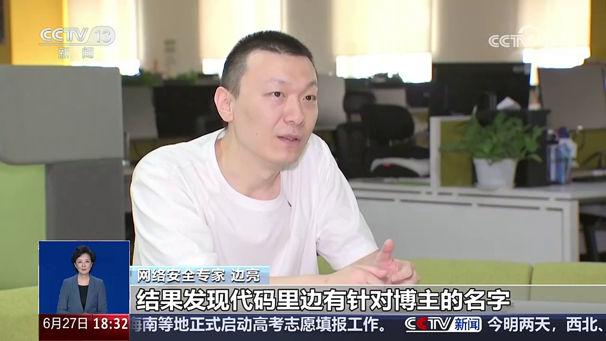

# 《网络测评活动规范》发文后，竟然还被我抓到云控特调！

> UP主：**边亮\_网络安全**（网络安全研究者） | 时长：6 分 02 秒 | 平台：Bilibili
> 属于系列合辑：**《手机媒体特调揭秘》**（第 7 集 / 共 7 集）
> 简介：接受央视新闻频道采访，揭秘手机测评乱象。在《网络测评活动规范》发文后，依然抓到厂商在进行云控特调。

---

## 核心内容

该视频是 **边亮\_网络安全** 持续追踪手机厂商"云控特调"作弊行为的系列合辑第 7 集，也是最新一集。核心内容：

1. **政策背景**：国家相关部门发布了 **《网络测评活动规范》**，旨在规范网络测评行业乱象
2. **"规范挡不住作弊"**：UP主指出，即便新规已正式发布，他依然在现场/直播中抓到了 **手机厂商通过云控手段特调跑分/性能表现** 的行为
3. **央视新闻频道采访**：UP主接受了央视新闻频道关于"手机测评乱象"的专题采访，该报道于 **2026 年 6 月 27 日 18:30** 播出
4. **关联报道**：[央视网快看《谁给钱就夸谁，专业"测评"还是商业"套路"？》](https://www.bilibili.com/video/BV1fp7s6LEy1) 在 14:55 开始涉及边亮的采访内容

---

## 系列合辑《手机媒体特调揭秘》全目录

该合辑系统性地揭露了手机厂商通过云端远程操控设备性能、针对评测软件"特调"的完整链条：

| # | 标题 | BV号 | 时长 | 播放量 |
|---|------|------|------|--------|
| 1 | [为什么你的手机不如评测说的好用？](https://www.bilibili.com/video/BV1ypqDYDEoW/) | BV1ypqDYDEoW | 2:45 | 34.5 万 |
| 2 | [离谱代码把我逗笑了，为什么媒体机比零售机跑分高？](https://www.bilibili.com/video/BV1GDwzeFE3S/) | BV1GDwzeFE3S | 3:52 | 61.5 万 |
| 3 | [我把云控漏洞交给厂商，厂商发了我半个牙刷兑换券..](https://www.bilibili.com/video/BV1WhdPYeEyE/) | BV1WhdPYeEyE | 5:52 | 59.8 万 |
| 4 | [我一不小心挖到了老板的云控VIP....](https://www.bilibili.com/video/BV1JkocYpERf/) | BV1JkocYpERf | 4:44 | 19.8 万 |
| 5 | [揭秘针对小白测评最新 8.5 模型的媒体特调](https://www.bilibili.com/video/BV1AbEnzfEAZ/) | BV1AbEnzfEAZ | 9:49 | 30.1 万 |
| 6 | [52个应用启动也流畅？最新媒体特调代码揭秘](https://www.bilibili.com/video/BV1rhnyzaEnd/) | BV1rhnyzaEnd | 8:32 | 31.1 万 |
| **7** | **《网络测评活动规范》发文后，竟然还被我抓到云控特调！** | **BV1Vy7H6eEyh** | **6:02** | **29.7 万** |

---

## 关于"云控特调"

**云控特调**（Cloud-Controlled Special Tuning）指的是手机厂商通过云端服务器远程识别设备身份（如 IMEI、SN 号、应用包名等），当检测到设备正在运行跑分软件或评测应用时，临时解除性能限制、拉高频率，以获得更高的跑分和更流畅的测试表现。零售用户日常使用到的手机，则不会触发此模式，导致"评测说的"和"用户拿到的"是两台完全不同的手机。

---

## 统计信息

| 指标 | 数据 |
|------|------|
| 播放量 | **29.7 万** |
| 弹幕 | 1,241 |
| 评论 | **4,651** |
| 点赞 | **16,567** |
| 硬币 | 5,664 |
| 收藏 | 2,995 |
| 分享 | 2,962 |
| 荣誉 | 热门收录 |

---

## 说明

> 该视频无字幕文件（Bilibili API 返回 `subtitle.list: []`），Bilibili 对直接下载音频/视频设置了反爬限制（HTTP 412），因此无法提供逐句转写文本。以上总结基于 Bilibili 开放 API 返回的元数据和系列上下文整理。
